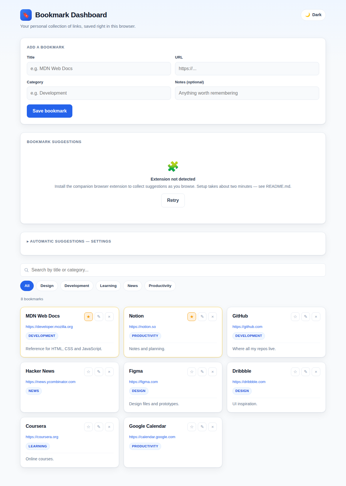
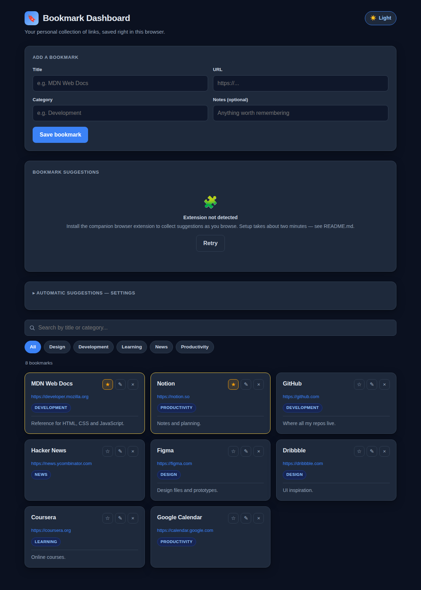

# My Bookmarks App + Automatic Bookmark Suggestions

A single‑file bookmark dashboard (`index.html`, browser `localStorage`) plus an
optional **Manifest V3 browser extension** that suggests pages you visit as
bookmarks.

Everything runs **locally in your browser**. There is no server, no account, no
API key, and nothing is ever sent over the network. The extension and the
dashboard talk to each other through the browser's own per‑extension
`chrome.storage.local`, relayed to the dashboard page by a content script using a
per‑page random nonce and a strict, validated message allow‑list.

**Repository:** <https://github.com/HRaza077/Bookmarks> · Issues and questions welcome there.
**Live demo:** <https://hraza077.github.io/Bookmarks/> · **Privacy policy:** <https://hraza077.github.io/Bookmarks/privacy.html>

## Screenshot

| Light | Dark |
|---|---|
|  |  |

```
my-bookmarks-app/   (a git clone makes this "Bookmarks/" — either name works, see §8)
├─ index.html                     the dashboard (open this)
├─ privacy.html                   plain-language privacy policy
├─ extension/                     the MV3 extension (load this unpacked)
│  ├─ manifest.json
│  ├─ background.js               service worker – watches tabs, builds suggestions
│  ├─ bridge.js                   content script – syncs storage <-> dashboard page
│  ├─ popup.js / popup.html       toolbar popup – quick enable / pause / counts
│  ├─ icons/
│  └─ shared/suggest-core.js      URL normalization, dedupe, message validation
│                                 (the ONE canonical copy — loaded by the worker,
│                                 the content script, the dashboard, and the tests)
├─ tests/
│  ├─ run.html                    double‑click test runner (no tooling needed)
│  ├─ run-node.mjs                `node --test` runner (used by CI)
│  └─ cases.js                    shared test cases
├─ tools/static-server.ps1        dev helper – serve the folder over http://localhost
├─ docs/                          screenshots used in this README
├─ .github/workflows/test.yml     CI – runs the test suite on push / PR
├─ LICENSE                        MIT
└─ README.md
```

---

## 1. Open the dashboard

Double‑click **`index.html`**. It works on its own — add, edit, favourite,
search, filter, delete, dark mode, all in `localStorage`.

The **Bookmark Suggestions** section shows *“Extension not detected”*, and after a
few seconds a one‑time prompt offers to set the extension up (**“Get suggested
bookmarks as you browse”**). Follow it, or install manually below.

---

## 2. Install the extension

The first time the dashboard loads without the extension, it shows a one‑time
prompt. **Yes, enable suggestions** takes you to the setup; **Not now** hides it
for 14 days. Once the extension connects even once, the prompt never returns, and
the dashboard re‑detects it automatically when you come back to the tab.

> A web page can't install a browser extension for you — that click has to happen
> on the Chrome Web Store / Edge Add‑ons page, or as an unpacked developer
> install. The extension isn't in a store yet, so use the steps below (this is
> also where **Not now** / the panel's **Retry** button lead).

### Chrome

1. Go to `chrome://extensions`.
2. Turn on **Developer mode** (top‑right).
3. Click **Load unpacked** and choose the **`extension/`** folder
   (`…/my-bookmarks-app/extension`).
4. The extension **“Bookmark Suggestions — My Bookmarks Dashboard”** appears.
5. Click **Details** on that extension and turn **ON**
   **“Allow access to file URLs.”**
   *(Required so the extension can talk to `index.html` when you open it from a
   file. Skip this only if you serve the dashboard over `http://localhost` — see
   §6.)*
6. Re‑open / refresh `index.html`. The suggestions section switches to
   *“No new suggestions”*. Browse a few sites and they start appearing.

### Microsoft Edge

Identical, at `edge://extensions`:

1. `edge://extensions` → enable **Developer mode** (left sidebar).
2. **Load unpacked** → choose the `extension/` folder.
3. **Details** → enable **“Allow access to file URLs.”**
4. Refresh `index.html`.

The same unpacked folder works in both browsers — no changes needed.

### Dismissed the prompt?

Open the collapsible **Automatic Suggestions** panel on the dashboard and use its
**Retry** button, or just reload after installing. When `CHROME_STORE_URL` /
`EDGE_STORE_URL` in `index.html` are filled in (after the extension is
published), the prompt's **Yes** button opens the matching store page instead.

---

## 3. How it decides what to suggest

When a tab finishes loading or changes URL, the service worker reads only that
tab's `url`, `title`, and `favIconUrl` (permissions: **`tabs`** + **`storage`**
only — no host permissions, no content scripts on the sites you browse, no
history API). A page becomes a suggestion **unless**:

| Ignored | Notes |
|---|---|
| Already bookmarked | compared on a **normalized** URL |
| Already dismissed | exact URL (or whole domain, if you enable domain mode) |
| Already a pending suggestion | several tabs on one URL → one suggestion |
| The dashboard page itself | |
| `chrome://`, `edge://`, `about:`, `view-source:` | any non‑`http(s)` scheme |
| Extension pages (`chrome-extension://`, `moz-extension://`) | |
| New tab / blank pages | |
| `localhost`, `127.0.0.1`, private IPs, `*.local` / `*.test` | unless **Development mode** is on |
| `data:` / `blob:` / `javascript:` / `file:` / `ftp:` | |
| URLs with embedded credentials, or longer than 2048 chars | |
| Incognito tabs | unless you enable it **and** grant “Allow in incognito” |

**URL normalization** (so trivially different URLs don't create duplicates):
lower‑cases the domain, drops `www.`, drops the `#fragment`, removes the trailing
slash, removes default ports, strips tracking parameters (`utm_*`, `gclid`,
`fbclid`, `msclkid`, …), and sorts the remaining query parameters.

---

## 4. The Yes / No workflow

Each suggestion card shows the favicon, title, URL, and when it was detected.

- **Yes, Save** → creates a bookmark using the dashboard's normal
  bookmark‑creation logic (category defaults to *Unsorted* — editable on the card
  first, or later with the ✎ button), removes the card, shows a toast, and tells
  the extension so the same URL isn't suggested again while it stays bookmarked.
- **No, Dismiss** → removes the card immediately and records the URL so it isn't
  suggested again. Clear this list any time from
  **Automatic Suggestions → Dismissed website history → Clear**.
- **Save All** / **Dismiss All** — same, in bulk, with a confirmation prompt.

If the dashboard is **closed**, the service worker keeps collecting suggestions
in `chrome.storage.local`; the next time you open the dashboard it syncs the full
pending list. Updates while it's open are near‑real‑time (via
`chrome.storage.onChanged`).

---

## 5. Settings — “Automatic Suggestions”

Collapsible panel on the dashboard (also partly in the toolbar popup):

| Setting | Default | Effect |
|---|---|---|
| Enable automatic suggestions | on | master switch |
| Suggest once per exact URL | on | dismissed URLs are never re‑offered |
| Treat a whole domain as one website | off | one suggestion per site; also blocks a bookmarked/dismissed domain |
| Development mode | off | also suggest `localhost` / private‑network / `*.local` pages |
| Monitor incognito windows | off | also requires the browser's “Allow in incognito” toggle |
| Pause suggestions | — | 1 hour / until tomorrow / off |
| Dismissed website history → Clear | — | lets previously dismissed sites be suggested again |

---

## 6. Optional: run the dashboard over http://localhost

If you'd rather not enable “Allow access to file URLs”, serve the folder:

```powershell
powershell -ExecutionPolicy Bypass -File tools\static-server.ps1
```

Then open `http://localhost:8777/index.html`. Add
`"http://localhost:8777/*"` to `content_scripts[0].matches` in
`extension/manifest.json` and reload the extension.

---

## 7. Tests

**No build tools required** — double‑click **`tests/run.html`**. It runs ~60
assertions covering URL normalization, the ignore rules, duplicate / dismissed /
pending detection, the suggestion‑list reducers, bookmark‑index building,
favicon hardening, the extension↔dashboard message protocol (nonce, protocol,
direction, action allow‑list, payload validation), and the first‑run install
prompt logic (browser detection + the show/hide + 14‑day‑cooldown decision).
The page title and `window.__TEST_RESULT__` report pass/fail counts.

If you install Node 18+ later:

```
node --test tests/run-node.mjs
```

There is no separate lint / type‑check / build step in this project.

---

## 8. Security summary

- **No network traffic.** No backend, no third‑party calls, no telemetry.
- **Minimal permissions**: `tabs`, `storage`. No `host_permissions`, no
  `scripting`, no `webNavigation`, no `history`, no `<all_urls>` content scripts.
- The content script runs only on `file://` paths inside a folder named
  `my-bookmarks-app` / `Bookmarks` (the manifest `content_scripts[0].matches`),
  and each run re‑checks for the `<meta name="bookmark-dashboard">` marker before
  doing anything. It exposes **no** `chrome.*` API to the page — only a fixed
  list of validated operations. If your folder has a different name, add it to
  that `matches` array and reload the extension.
- Page → extension messages require the per‑load random **nonce**; unknown
  actions and malformed payloads are dropped.
- Favicons are constrained to `http(s)` URLs or small `data:image/*` URIs and
  rendered with `referrerpolicy="no-referrer"` and a letter fallback.
- Incognito is off unless explicitly enabled in settings **and** allowed for the
  extension in the browser.
- No secrets exist in the codebase, because the design needs none.

## 9. Limitations / production notes

- **Local to one browser profile.** Bookmarks and suggestions do not sync across
  machines or browsers. Cross‑device sync would require a backend with real
  authentication — deliberately out of scope.
- **`index.html` is no longer strictly single-file** — it loads
  `extension/shared/suggest-core.js` with a `<script src>` tag, so the `extension/`
  folder must sit next to it. Opened without that file, the dashboard still runs
  but the suggestions section shows a setup message.
- Domain matching uses “hostname minus `www.`”, not the Public Suffix List, so
  `foo.github.io` and `bar.github.io` are treated as different domains, and
  `a.example.co.uk` / `b.example.co.uk` are also treated as different. Fine for
  personal use; swap in a PSL library if you need registrable‑domain grouping.
- SPA in‑page navigations are detected via `tabs.onUpdated` URL changes; a few
  history‑API‑only transitions on unusual sites may be missed (adding the
  `webNavigation` permission would fix this but was intentionally avoided).
- To publish the extension to the Chrome Web Store / Edge Add‑ons you'd add a
  store listing, a proper icon set, bump `version`, and host `privacy.html` at a
  public URL (e.g. enable GitHub Pages on this repo → the store listing links to
  `https://hraza077.github.io/Bookmarks/privacy.html`).

## 10. License & privacy

MIT licensed — see [`LICENSE`](LICENSE). See [`privacy.html`](privacy.html) for
the plain-language privacy policy (short version: nothing is collected, because
there's no server to collect it on).
